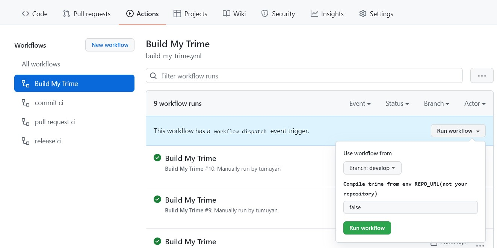

# TRIME：安卓同文輸入法without CMake版 /Android-rime

## 關於/About
源於開源的[注音倉頡輸入法]前端，  
基於著名的[RIME]輸入法框架，  
使用JNI的C語言和安卓的Java語言書寫，  
旨在保護漢語各地方言母語，  
音碼形碼通用的輸入法平臺。  

## 編譯/Build
由于移除了原仓库的CMake相关文件，改为内置预编译的so文件，使得clone和build难度得到了极大地下降。  
直接下载源码，或者clone，然后使用Android Studio打开即可。  
如需clone，建议使用如下命令，只获取最新的一个版本从而降低clone用时:  
`git clone --depth 1 https://github.com/tumuyan/trime-without-CMake`

## 下載/Download
本仓库所有功能性的变更，均会提交pr给原仓库。因此这里永远都不会编译并发布正式版。 
每次提交pr时，都会分享测试版本到同文用户QQ群。[github release页面](https://github.com/osfans/trime/releases)随缘更新。
已经修改包名、App name，与原版同文不存在冲突；但是如果在此版本和原版之间切换，建议先结束进程再切换。

## 使用/Use
使用方法与原版完全相同。

由于可能存在版本差异，建议与原版同文使用不同的文件夹。（设置方法：打开同文设置-输入配置-用户文件夹，修改路径并新建对应文件夹）
新增和调整的功能可以在github commit和pr说明中查看，wiki也有整理较大的变化： https://github.com/tumuyan/trime-without-CMake/wiki  

## 在線編譯客製化APK✨
本仓库提供了在线编译客制化APK的功能。  
Fork本仓库后，先根据需求修改`.github/workflows/build-my-trime.yml`中的参数；然后在Github Action中可以看到多个Workflows。点击`Build My Trime`，在右侧再点击`Run workflow`，等待2分钟即可完成build。  

编译结束后，点击对应项，在最下方有Artifacts。点击zip文件并下载、解压即可获得在线编译好的APK文件。  

#### 支持的客製化參數
| 项目                                        | 参数                                                       |
|-------------------------------------------|----------------------------------------------------------|
| ”关于“界面中的编译信息                              | CI_NAME: Custom CI                                       |
| ”关于“界面中的修改版QQ群                            | CUSTOM_QQ:                                               |
| ”关于“界面中的修改版QQ群链接                         | CUSTOM_QQ_LINK:                                          |
| 在点击`Run workflow`时如填入true,会使用此参数指定的仓库进行编译 | REPO_URL: https://github.com/tumuyan/trime-without-CMake |
| 上个参数指定的分支                                 | REPO_BRANCH: develop                                     |
| 仓库中的包名                                    | PACKAGE_NAME: com.tumuyan.trime                          |
| 修改后的包名                                    | PACKAGE_NAME_NEW: com.tumuyan.trime.pro                  |
| 仓库中的默认App名称                               | APP_NAME: Trime·Trime                                    |
| 仓库中的简中App名称                               | APP_NAME_CN: 同文输入法・Trime                                 |
| 仓库中的繁中App名称                               | APP_NAME_TW: 同文輸入法・Trime                                 |
| 修改后的默认App名称                               | APP_NAME_NEW: TrimePro                                   |
| 修改后的简中App名称                               | APP_NAME_NEW_CN: 同文输入法Pro                                |
| 修改后的繁中App名称                               | APP_NAME_NEW_TW: 同文輸入法Pro                                |

#### 更多客製化内容

计划依顺序自动完成以下工作

- [ ] 打包仓库中的主题
- [ ] 打包仓库中的方案
- [ ] 打包指定仓库的主题和方案
- [ ] 对图标进行替换
- [x] 对`关于`界面做客制化
- [x] 对`寻求帮助`界面做客制化
- [ ] 对UI、弹出信息中多次出现的Trime、同文等文本内容进行替换

## 鳴謝/Credits
- Developer: [osfans](https://github.com/osfans)
- Contributors: [boboIqiqi](https://github.com/boboIqiqi)、[Bambooin](https://github.com/Bambooin)、[senchi96](https://github.com/senchi96)、[heiher](https://github.com/heiher)、[abay](https://github.com/a342191555)、[iovxw](https://github.com/iovxw)、[huyz-git](https://github.com/huyz-git)、[tumuyan](https://github.com/tumuyan)、[WhiredPlanck](https://github.com/WhiredPlanck)...
- [Wiki Editors](https://github.com/osfans/trime/wiki): [xiaoqun2016](https://github.com/xiaoqun2016)、[boboIqiqi](https://github.com/boboIqiqi)...
- Translators: 天真可爱的满满 (Chinese Traditional), 点解 (English) ...
- Keyboard Designers: 天真可爱的满满、皛筱晓小笨鱼、吴琛11、熊猫阿Bo、默默ㄇㄛˋ...
- Donations: See QR Code in [Releases](https://github.com/osfans/trime/releases)
- Community: [Issues](https://github.com/osfans/trime/issues), [QQ Group（811142286）](https://jq.qq.com/?_wv=1027&k=AXdR80HN), [QQ Group（458845988）](https://jq.qq.com/?_wv=1027&k=n6xT4G3q), [Coolapk](http://www.coolapk.com/apk/com.osfans.trime), [Google Play](https://play.google.com/store/apps/details?id=com.osfans.trime) and [Tieba](http://tieba.baidu.com/f?kw=rime)
- Projects: [RIME]、[OpenCC]、[Android Traditional Chinese IME] and so on.

## 沿革/History
- 最初，輸入法是寫給[泰如拼音](http://taerv.nguyoeh.com/ime/)（tae5 rv2）的，中文名爲“泰如輸入法”。  
- 然後，添加了吳語等方言碼表，做成了一個輸入法平臺，更名爲“漢字方言輸入法”。  
- 後來，兼容了五筆、兩筆等形碼，在太空衛士、徵羽的建議下，更名爲“[同文輸入法平臺2.x](https://github.com/osfans/trime-legacy)”。寓意音碼形碼同臺，方言官話同文。  
- 之後，藉助JNI技術，享受了[librime](https://github.com/rime/librime)的成果，升級爲“同文輸入法平臺3.x”，簡稱“同文輸入法”。  
- 所以，TRIME是Tongwen RIME或是ThaeRvInputMEthod的縮寫。

## 第三方庫/Third Party Libraries
- [Boost C++ Libraries](https://www.boost.org/) (Boost Software License)
- [Cap'n Proto](https://capnproto.org/) (MIT License)
- [darts-clone](https://github.com/s-yata/darts-clone) (New BSD License)
- [LevelDB](https://github.com/google/leveldb) (New BSD License)
- [libiconv](https://www.gnu.org/software/libiconv/) (LGPL License)
- [marisa-trie](https://github.com/s-yata/marisa-trie) (BSD License)
- [minilog](http://ceres-solver.org/) (New BSD License)
- [OpenCC](https://github.com/BYVoid/OpenCC) (Apache License 2.0)
- [RIME](https://rime.im) (BSD License)
- [snappy](https://github.com/google/snappy)(BSD License)
- [UTF8-CPP](http://utfcpp.sourceforge.net/) (Boost Software License)
- [yaml-cpp](https://github.com/jbeder/yaml-cpp) (MIT License)
- [Android Traditional Chinese IME](https://code.google.com/p/android-traditional-chinese-ime/) (Apache License 2.0)

[Android Traditional Chinese IME]: https://code.google.com/p/android-traditional-chinese-ime/
[RIME]: http://rime.im
[OpenCC]: https://github.com/BYVoid/OpenCC
